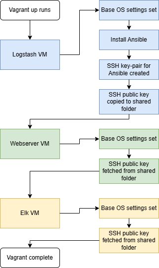

# SIEM-in-a-box
An automated security monitoring lab with three VMs provisioned via Vagrant and configured with Ansible, featuring an Nginx web server, Logstash log pipeline, and an ELK stack for log analysis.

## Table of contents
1. Architecture
2. Environments and IP addresses
3. Folder structure
4. Components
5. Requirements and prerequisites
6. Getting started
7. Secrets
8. Security measures
9. Security analysis
10. Verification
11. Design choices and motivation

## 1. Architecture


### Topology


### Flowchart vagrant


### Flowchart ansible playbook


## 2. Environments and IP addresses

| VM | Role | IP address | Ports in use | Description |
|---|---|---|---|---|
| elk | SIEM node | 192.168.56.10 | 9200 5601 | Elasticsearch + Kibana, stores and visualizes logs |
| logstash | Ansible controller + Log pipeline | 192.168.56.11 | 5044 | Runs Ansible, receives logs from Filebeat and forwards to Elasticsearch |
| webserver | Monitored web server | 192.168.56.12 | 80 | Nginx + Filebeat, sends logs to Logstash |

## 3. Folder structure
```
project-siem/
├── .gitignore                      # Contains filenames that won't be pushed to git repo
├── ansible.cfg                     # Ansible configuration (inventory, host key checking)
├── ansible_id_ed25519.pub          # Public SSH key used by Ansible to connect to VMs
├── flowchart_ansible_playbook.png  # Visualization of the Ansible playbook data flow
├── flowchart_vagrant.png           # Visualization of Vagrant startup script
├── inventory.ini                   # Defines which servers Ansible manages and in which groups
├── README.md                       # Project documentation
├── secrets.txt                     # Credentials for Elasticsearch and Kibana (gitignored)
├── site.yml                        # Master playbook — runs all roles in correct order
├── Vagrantfile                     # Defines all VMs and network settings
├── verify.yml                      # Verification script that checks installed programs, open ports and log data flow
├── .vagrant/                       # Auto-generated by Vagrant (do not edit)
│   ├── bundler/
|   |   └── global.sol
│   ├── machines/
│   │   ├── elk/
│   │   │   └── virtualbox/
│   │   ├── logstash/
│   │   │   └── virtualbox/
│   │   └── webserver/
│   │       └── virtualbox/
│   ├── provisioners/
│   │   └── ansible/
│   │       └── inventory/
│   │           └── vagrant_ansible_inventory
│   └── rgloader/
│       └── loader.rb
├── group_vars/
│   └── all.yml                    # Variables shared across all hosts
├── host_vars/
│   ├── 192.168.56.10.yml          # Variables specific to elk node
│   ├── 192.168.56.11.yml          # Variables specific to logstash node
│   └── 192.168.56.12.yml          # Variables specific to webserver node
└── roles/
    ├── docker/                    # Installs Docker Engine on the elk node
    │   └── tasks/
    │       └── main.yml
    ├── elk/                       # Installs Elasticsearch and Kibana via Docker
    │   └── tasks/
    │       └── main.yml
    ├── filebeat/                  # Installs and configures Filebeat to ship Nginx logs
    │   ├── handlers/
    │   │   └── main.yml
    │   └── tasks/
    │       └── main.yml
    ├── firewall                   # Installs and configures firewalls on all hosts
    │   └── tasks/
    │       └── main.yml
    ├── logstash/                  # Installs and configures Logstash pipeline
    │   ├── handlers/
    │   │   └── main.yml
    │   └── tasks/
    │       └── main.yml
    └── nginx/                     # Installs Nginx web server
        ├── files/
        │   └── index.html
        └── tasks/
            └── main.yml
```
## 4. Components

### .gitignore
Holds secret.txt and ansible_id_ed25519.pub that holds credentials and SSH keys.

### ansible.cfg
Disables host key checking and specifies inventory.ini as the default inventory file.

### inventory.ini
Groups the servers into [logstash], [elk] and [webserver]. Specifies IP addresses and vagrant as the Ansible user. Logstash uses ansible_connection=local since Ansible runs directly on that node.

### Secret.txt
Holds the login credentials for Elastic SIEM. 

### site.yml
Playbook that installs and configures all components in order: 
1. **Update** — runs apt update and upgrade on all nodes
2. **ELK** — installs Docker, Elasticsearch and Kibana on the elk node
3. **Logstash** — installs and configures Logstash on the logstash node
4. **Nginx** — installs Nginx web server on the webserver node
5. **Filebeat** — installs and configures Filebeat to ship Nginx logs to Logstash

### Vagrantfile
Defines three virtual machines in VirtualBox with a shared host-only network (192.168.56.0/24). Logstash starts first so that Ansible can SSH into the other VMs.

### Docker Role
Installs Docker Engine on the elk node. Adds the official Docker GPG key and repository, installs Docker Engine with all required plugins, and adds the vagrant user to the docker group so that Docker commands can be run without sudo. Elasticsearch and Kibana run as Docker containers.

### ELK Role 
Docker engine installs Elasticsearch and Kibana on the elk node. The docker install comes with pre-set configurations, like file paths and necessary dependencies. Elasticsearch stores and indexes logs received from Logstash.  
Kibana visualizes the logs stored in Elasticsearch for search and analysis.

### Filebeat Role
Installs Filebeat on the webserver node, and configures it to collect Nginx logs and forwards them to port 5044 on the logstash node.

### Logstash Role
Installs Java (required by Logstash), adds the Elastic repository and installs Logstash 9.3.3. Configures a pipeline that:
- **Input** — listens for incoming logs from Filebeat on port 5044
- **Filter** — tags incoming logs as `web_server_logs` for easier searching in Kibana
- **Output** — forwards processed logs to Elasticsearch on port 9200

### Nginx Role
Installs Nginx on the webserver node and brings a sample website online.

### Firewall Role
Configures firewall on all nodes.

## 5. Requirements and prerequisites
Software that must be installed on the Windows host:

* [VirtualBox](https://www.virtualbox.org/) — (tested with version 7.x)
* [Vagrant](https://www.vagrantup.com/) — (tested with version 2.x)
* [Git](https://git-scm.com/)

Hardware requirements:

* At least 8,5 GB free RAM (Currently and recommended 12,5 GB free RAM for ansible-playbook to run smoothly)
* At least 120 GB free disk space (Default VM disc size)


## 6. Getting started

**1.   Clone Github repo**

git clone git@github.com:rswahn-sw/project-siem.git
cd project-siem

**2. Start VMs**

vagrant up

**3. Connect remotely to the Ansible control VM (runs on logstash node) with SSH**

vagrant ssh logstash

**4. Move to project folder (Vagrantfile automatically clones the git repo to logstash VM on creation)**

cd project-siem

**5. Run playbook**

ansible-playbook site.yml

**6. Run verify.yml script to generate test logs**

ansible-playbook verify.yml

**7. Navigate to SIEM**

open a web browser (host computer) and navigate to http://192.168.56.10:5601 (Kibana port at elk node VM)

**8. Fetch elastic credentials from secrets.yml (root folder) and log into Kibana**

username=elastic, password=ES_LOCAL_PASSWORD from secrets.yml

### Expected result
You should be able to find an automated http request from a curl source in the logs. You can create more logs by navigating to http://192.168.56.12 from your host computer (nginx sample page).

## 7. Secrets
This files contains information about Elasticsearch and Kibana, including credentials. This can be encrypted with Ansible vault after logging in.

## 8. Security measures

| Measure | Where | How to verify |
|---|---|---|
| Private network | All VMs | VMs only communicate on 192.168.56.0/24, not accessible from internet |
| GPG key verification | All VMs | Packages verified with official GPG keys before installation |
| Elasticsearch and Kibana requires authentication | ElK node | curl http://192.168.56.10:9200 and curl http://192.168.56.10:5601 - should return 401 Unauthorized |
| All credentials and SSH keys are in seperate files and generated locally | Host | Old SSH keys and passwords will not work when you generate VMs again | 
|UFW Firewalls | All VMs | SSH into each VM and rund sudo ufw status |


## 9. Security analysis

### Remaining vulnerabilities

**Vulnerability 1: Unencrypted communication**

All traffic between VMs uses unencrypted HTTP. An attacker with access to the internal network could read or manipulate the traffic.

*Remediation*: Configure the network to use HTTPS traffic for communication between Filebeat, Logstash, Elasticsearch and Kibana.

*Accepted in this environment because*: The private network (192.168.56.0/24) is isolated from the internet and only accessible from the host machine. This lab environment is for proof of concept only and should not contain any sensitive information.  

**Vulnerability 2: Host key checking disabled**

`host_key_checking = False` in ansible.cfg means Ansible does not verify the identity of the hosts it connects to, which could allow man-in-the-middle attacks.

*Remediation*: Enable host key checking and manually distribute known host keys before running Ansible, or use a pre-configured known_hosts file.

*Accepted in this environment because*: In a local lab environment with no external access, the risk is considered acceptable.

**Vulnerability 3: All logs forwarded without filtering**

Filebeat is configured to forward all Nginx logs to Logstash without any filtering or rate limiting, which could overwhelm the pipeline with unnecessary data.

*Remediation*: Configure Filebeat and Logstash filters to only forward relevant log entries and add rate limiting.

*Accepted in this environment because*: In a lab environment with low traffic, the volume of logs is not a concern.

## Production considerations
### Infrastructure
* Real servers or cloud services instead of VMs.
* Load balancing and redundancy, multiple servers so that if one goes down, everything doesn't stop working.

### Security
* HTTPS and TLS everywhere for encrypted traffic.
* SSH key passphrase.
* Secrets management via Ansible Vault.
* Stricter firewall rules, e.g. Elk VM only accepts connections from Logstash VM.

### Ansible
* Dedicated Ansible server instead of running from Logstash.
* Role-based access control, not everyone can run playbook.

### Monitoring
* Restrict which logs are sent, do not send everything.
* Old logs are automatically cleared.
* Alerting in Kibana, triggers an alarm when something abnormal happens.


## 10. Verification
If the logs shows up in Kibana it means that everything is configured and working correctly. You can check that the logstash port is open and listening and that filebeat knows where to send the logs, but if it does not the logs will never show up in Kibana (verification script handles this automatically and reveals error message on failure).


## 11. Design choices and motivation
### Logstash as Ansible control and starts first
The logstash node is in the middle of the data flow and already need connections to both other VMs. This makes it suitable to run Ansible as well since the playbook will only run once. The logstash node is created first because it generates the SSH keys that Ansible will use for the other VMs.

### SSH key distribution via shared folder
Instead of manually distributing SSH keys, Logstash generates an ed25519 key pair during provisioning and copies the public key to the shared `/vagrant` folder. Webserver and elk automatically pick up the key and add it to `authorized_keys`. This makes the setup fully automated as well as never shares the sensitive private SSH key.

### ELK stack via Docker
Elasticsearch and Kibana are installed via Docker using Elastic's official start-local script instead of installing them directly on the VM. This simplifies the installation and ensures a consistent and supported configuration.

### Private network
All VMs communicate on an isolated host-only network. This isolates the lab from the internet and avoids port conflicts with the host machine.

### Separate Ansible roles
Each component has its own Ansible role (docker, elk, logstash, nginx, filebeat). This makes every individual role easy to maintain, as well as allowing scalability by adding new roles.

### Specific versions
Logstash, Elasticsearch and Filebeat are set to specific version numbers to ensure compatibility.

### Variables
The variables supports scalability by allowing a value to be used multiple times but can be edited in just one place.